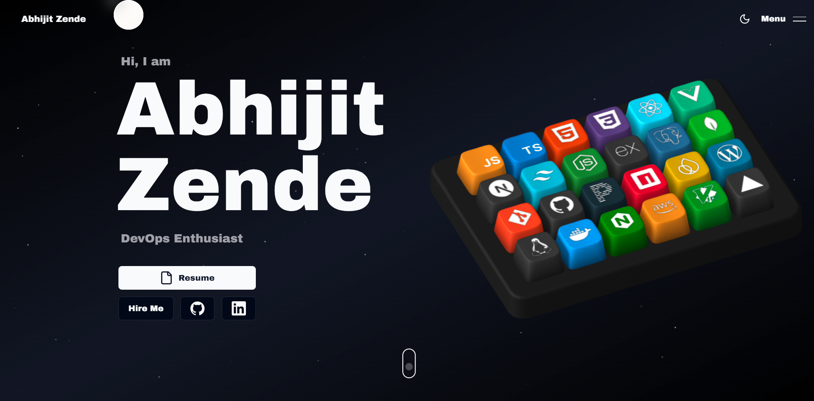

# 🚀 My Portfolio Website

Welcome to the repository for my personal portfolio website! 🎉 This project is a culmination of creativity, technology, and my dedication to showcasing my skills, projects, and personality in a visually stunning and interactive manner.

### Live preview: [Coming Soon]

## 🔥 Features

Here are the key highlights of my portfolio:

### 🎹 **3D Interactive Animations**
- Features a custom-made interactive keyboard built with **Spline**.
- Each keycap represents a skill and reveals titles and descriptions on hover for an immersive experience.
- Smooth, responsive 3D interactions that captivate visitors.

### ✨ **Slick Interactions & Animations**
- Powered by **GSAP** and **Framer Motion**, delivering buttery-smooth animations on scroll, hover, and element reveals.
- Creative motion designs that enhance storytelling and keep users engaged.

### 🌌 **Space-Themed Design**
- Particles floating on a dark, cosmic background simulate an outer-space vibe.
- Adds a unique and futuristic look to the portfolio.

### 📱 **Responsive Design**
- Fully responsive layout ensures the website looks and functions beautifully on all devices.
- Optimized for both desktop and mobile experiences.

### 🧠 **Innovative Web Design**
- Combines cutting-edge technology with an intuitive user experience.
- Creative use of animations and visuals to push the boundaries of modern web design.

## 🛠️ Tech Stack

The portfolio website is built using the following tools and technologies:

- **Frontend:** Next.js, React, Tailwind CSS, Shadcn, Aceternity UI
- **Animations:** GSAP, Framer Motion, Spline Runtime
- **Other Tools:** Resend, Socket.io, Zod

## 🌟 Getting Started

1. Clone this repository:
   ```bash
   git clone https://github.com/vrajkumarpatel/Portfolio_Website.git
   ```

2. Navigate to the project directory:
   ```bash
   cd Portfolio_Website
   ```

3. Install dependencies:
   ```bash
   npm install
   ```

4. Set up environment variables:
   ```bash
   # Create a .env.local file in the root directory
   touch .env.local

   # Add your Resend API key (if using contact form features)
   RESEND_API_KEY=your_resend_api_key_here
   ```

5. Start the development server:
   ```bash
   npm run dev
   ```

6. Open your browser and navigate to:
   ```
   http://localhost:3000
   ```

## 🚀 Deployment

This project is deployed using **Netlify** for its blazing-fast performance and ease of use.

## 💖 Acknowledgments

A huge shoutout to [Naresh Khatri](https://github.com/Naresh-Khatri/Portfolio) for the inspiration and ideas that sparked this journey! 💡

## 📬 Contact

Feel free to reach out to me for collaboration, feedback, or just to say hi! 😊

- **LinkedIn:** [Vrajkumar Patel](https://linkedin.com/in/vrajkumar-patel-87200017b)
- **Instagram:** [@vraj___patel__07](https://instagram.com/vraj___patel__07)
- **GitHub:** [vrajkumarpatel](https://github.com/vrajkumarpatel)

---

⭐ If you like this project, don't forget to give it a star!
