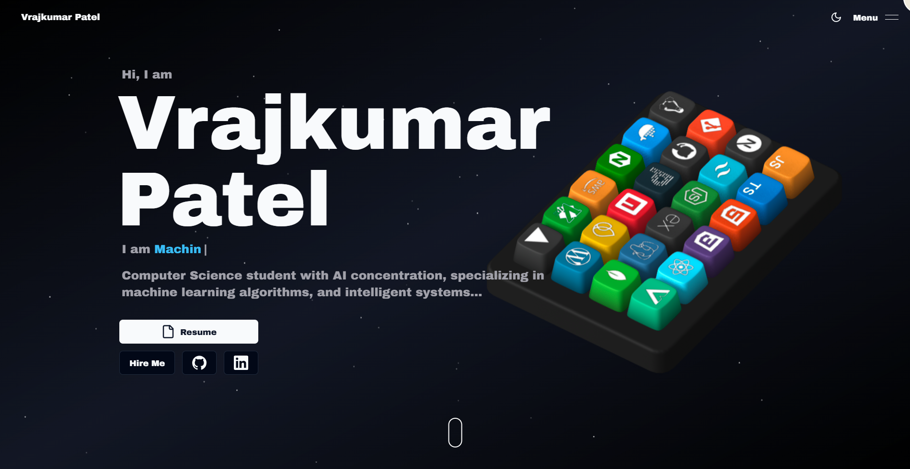

# My Portfolio Website

Source for my personal portfolio site — built to showcase my projects, skills, and background.

**Live: [vrajpatel.info](https://vrajpatel.info/)**

## Features

- **3D interactive keyboard** built with Spline — each keycap represents a skill and reveals details on hover.
- **Scroll/hover animations** via GSAP and Framer Motion.
- **Space-themed visual design** — particle background, dark cosmic palette.
- **Fully responsive** across desktop and mobile.

## Tech Stack

- **Frontend:** Next.js, React, Tailwind CSS, shadcn/ui, Aceternity UI
- **Animation:** GSAP, Framer Motion, Spline Runtime
- **Other:** Resend (contact form), Socket.io, Zod

## Getting Started

```bash
git clone https://github.com/vrajkumarpatel/Portfolio_Website.git
cd Portfolio_Website
npm install

# Create .env.local with a Resend API key for the contact form
touch .env.local
echo "RESEND_API_KEY=your_resend_api_key_here" >> .env.local

npm run dev
```

Then open [http://localhost:3000](http://localhost:3000).

## Deployment

Deployed on Netlify.

## Contact

- **LinkedIn:** [Vrajkumar Patel](https://linkedin.com/in/vrajkumar-patel-87200017b)
- **Email:** vp431030@gmail.com
- **GitHub:** [vrajkumarpatel](https://github.com/vrajkumarpatel)
- **Instagram:** [@vraj___patel__07](https://instagram.com/vraj___patel__07)

---

⭐ If you like this project, don't forget to give it a star!
